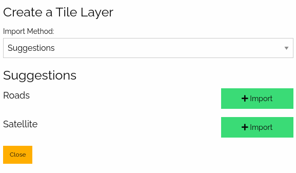
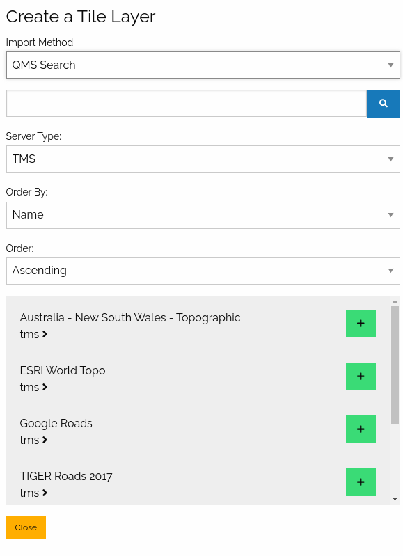
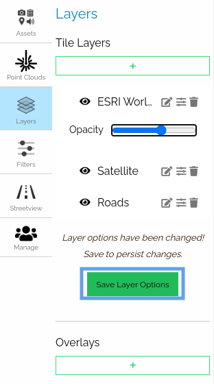
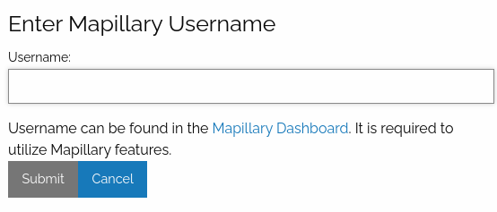
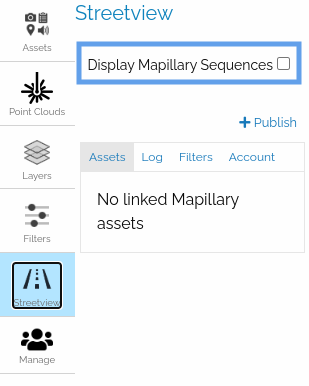
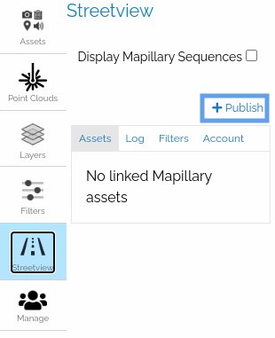
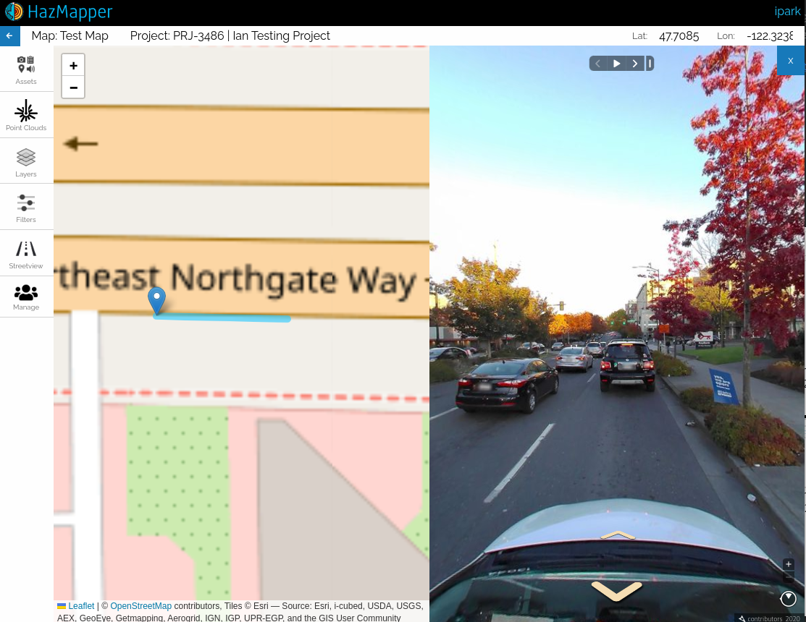
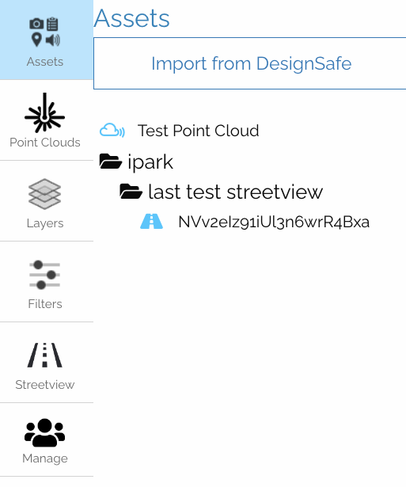
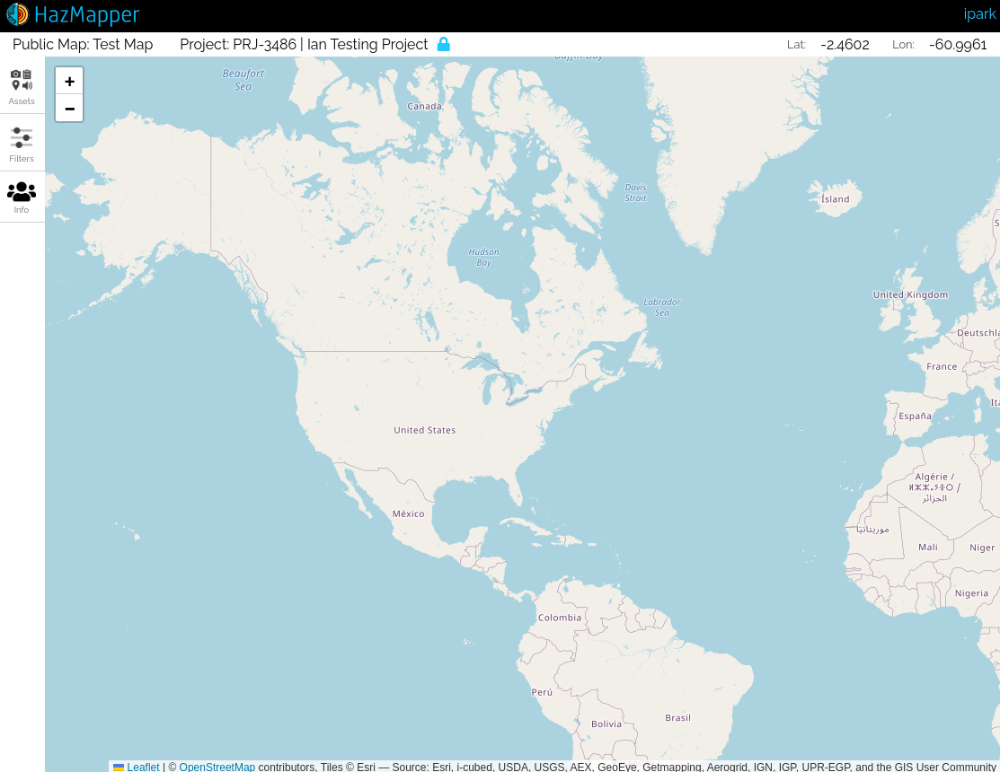

## Introduction

## Geospatial Application
DesignSafe HazMapper is a rich web-based application for visualizing and analyzing geospatial data ([assets](#supported-asset-types)).

### Accessing Hazmapper
To access Hazmapper from Designsafe, the user can first navigate to the top menu bar and find *Workspace* (*Fig 1.1*).

<figure><figcaption align = "center"><b>Fig 1.1</b></figcaption></figure>

From there, the user can hover on the *Workspace* section and select *Tools & Application* (*Fig 1.2*).

<figure style="display: flex; justify-content: center; align-items: center; flex-direction: column"><figcaption align = "center"><b>Fig 1.2</b></figcaption></figure>

From the *Tools & Applications* page, the user can navigate to *Hazmapper (2.0)* (*Fig 1.3*) and then *Launch Hazmapper* (*Fig 1.4*).

<figure><figcaption align = "center"><b>Fig 1.3</b></figcaption></figure>

<figure><figcaption align = "center"><b>Fig 1.4</b></figcaption></figure>

|  
||:--:
|| <b>Image Credits - Fig.2 - 4K Mountains Wallpaper</b>|

## Interface Overview

### Welcome Menu

The welcome menu is the first interface that the user will see. This menu lists all of the [maps](#maps) that are tied to the user either from [creating the map](#project-creation-prompt) or from a [shared map](#shared-maps) (*Fig 2.1*).

The header of the menu displays the name of the map and the DesignSafe project that it is saved in. If it is saved to the Data Depot, it will show a `----------`. 

On the rightmost side of the header is the  *Create a New Map* button, which opens the [map creation prompt](#project-creation-prompt).

The icons on the right side of each map item are *edit*   and  *delete* . 

To access a map, the user can either click on a map item or click on the *edit*   button. To delete a map, the user can click on the *delete*  button of a map.

<figure><figcaption align = "center"><b>Fig 2.1</b></figcaption></figure>

### Map Creation Prompt
Clicking on the  *Create a New Map* button from the [welcome menu](#welcome-menu) (*Fig  2.2*) will open the project creation prompt. This prompt will guide the user through options needed to create a map.

<figure><figcaption align = "center"><b>Fig 2.2</b></figcaption></figure>

First, the user is required to give the map a name and a description.

Once the user selects the name and description, unless manually specified, the map will be saved to a file with the same name as the map name with a `.hazmapper` extension.

Next, by browsing through the file browser, the user can select a location in the DesignSafe Data Depot the map will be saved to.

For clarity, the selected location will be displayed in the *Save Location* section.

Finally, the user is given the option to sync the folder through the *Sync Folder* checkbox. 

This will make the created map a [syncing map](#syncing-map).

Once you create a map or select a map from the welcome menu, you will see the following interface.

<figure><figcaption align = "center"><b>Fig 2.3</b></figcaption></figure>

### Title bar

We will start the overview of the map interface by first looking at the title bar section of the interface.

Starting from the left to right, we can see a left arrow button .
Clicking on this button will bring the user back to the welcome menu we looked into in the previous section.

The next part of the title bar is the name of the map with the associated DesignSafe Project if it exists.

The last part of the title bar is the latitude and longitude coordinates indicating the location of the mouse cursor when hovering on the map.

<figure><figcaption align = "center"><b>Fig 2.4</b></figcaption></figure>

### Panels

Next, we will take a look at the panel interface of Hazmapper.

Panels are the primary interface a user can interact with the map and handle [assets](#supported-asset-types) on the map.

<figure><figcaption align = "center"><b>Fig 2.5</b></figcaption></figure>

#### Assets Panel
The assets panel is the hub of all of the [map-associated feature assets](#map-associated-assets). Here users can add, view, and delete each asset.

By clicking on *Import from DesignSafe*, users can open the import prompt (*Fig 2.6*) and add appropriate files from DesignSafe Data Depot (My Data, Projects, Community Data, Published Data). 

<figure style="display: flex; justify-content: center; align-items: center; flex-direction: column"><figcaption align = "center"><b>Fig 2.6</b></figcaption></figure>

<figure><figcaption align = "center"><b>Fig 2.7</b></figcaption></figure>

**NOTE**: *The file browser works like the file browsers on our computers. `Shift-Click` allows the user to select multiple items. And `Control-Click` (only on Windows) allows the user to select multiple assets without losing the previous selection.*

Once imported, the selected assets will be listed inside the panel.
A user can click on each asset to jump to the asset location on the map or to get the metadata associated with the asset.

<figure style="display: flex; justify-content: center; align-items: center; flex-direction: column"><figcaption align = "center"><b>Fig 2.8</b></figcaption></figure>

**NOTE**: *Unless imported from the top-level (i.e. in the root of the folder), image, video, streetview assets will show up in the folders they are located in. On the other hand, point-cloud assets will always display at the root of the asset tree.*

#### Point Clouds Panel
This panel allows users to create point cloud objects that associate point clouds assets (las or laz).

**Note**: *Once the assets are attached they will show up in the [Assets Panel](#assets-panel)*.

<figure style="display: flex; justify-content: center; align-items: center; flex-direction: column"><figcaption align = "center"><b>Fig 2.9</b></figcaption></figure>

The user can open the point cloud creation prompt by clicking on the *Add* button.

In the point cloud creation prompt, the user is required to create a *Description* for the point cloud object (This will be the name displayed in the assets panel as well). After that, by clicking on the *Submit* button, the user can create a point cloud object.

<figure><figcaption align = "center"><b>Fig 2.10</b></figcaption></figure>

Once created, the point cloud object with be shown in the panel.

Now, the user can add a point cloud asset (las or laz), delete  the point cloud object, or view  the object information.

To add a point cloud asset to the point cloud object, the user must click on the *Add las/laz* button.

<figure style="display: flex; justify-content: center; align-items: center; flex-direction: column"><figcaption align = "center"><b>Fig 2.11</b></figcaption></figure>

This will open a file browser, similar to the one used to [import assets](#file-browser) in the assets panel.

From the file browser, the user must select either a **las** or **laz** file and click *Import*.

<figure><figcaption align = "center"><b>Fig 2.12</b></figcaption></figure>

The import process will take a while depending on the size of the point cloud file. However, once imported, the asset should show up on the *Assets* panel and the map (as a bounding box covering the extent of the point cloud).

If the user clicks on the *View* button on the information box, the Potree Viewer will open.

<figure><figcaption align = "center"><b>Fig 2.13</b></figcaption></figure>

The Potree Viewer can be used for further analysis of the point cloud.

The URL to the Potree Viewer created for the asset will be permanent as long as the asset exists. Furthermore, this can be shared with other researchers.

<figure><figcaption align = "center"><b>Fig 2.14</b></figcaption></figure>

#### Layers Panel
Using this panel users can select, create, edit, or delete tile layers.
By default, the user will see the Satellite and Roads basemap layers.

Additionally, users can create an overlay image for the map. This means, given a jpg image with their geospatial coordinates, users can select the bounding coordinates and place the raster data on the map. 

By default, the **Roads** and **Satellite** base layers will be added and enabled.

<figure style="display: flex; justify-content: center; align-items: center; flex-direction: column"><figcaption align = "center"><b>Fig 2.15</b></figcaption></figure>

To add more layers, the user must click on the  button directly under *Tile Layers*.

This will open the tile layer creation prompt.

The default layers (**Roads**, **Satellites**) can be added directly in the case that the user deletes the default layers.

Otherwise, the user can choose among the [supported tile layer formats](#supported-tile-formats) as the *Import Method*.

<figure><figcaption align = "center"><b>Fig 2.16</b></figcaption></figure>

The **Manual** import method will have additional prompts that each tile layer type method requires.

<figure><figcaption align = "center"><b>Fig 2.17</b></figcaption></figure>

The **INI file** import method will show a file browser similar to the one used to [import assets](#file-browser).

Here the user must select a `.ini` file containing the required tile layer data.

<figure><figcaption align = "center"><b>Fig 2.18</b></figcaption></figure>

The **QMS Search** import method utilizes [Quick Map Services](https://qms.nextgis.com/) to search for various tile layers and add them to the map.

<figure><figcaption align = "center"><b>Fig 2.19</b></figcaption></figure>

Once the user creates the tile layer, it will show up on the layers panel.

<figure style="display: flex; justify-content: center; align-items: center; flex-direction: column"><figcaption align = "center"><b>Fig 2.20</b></figcaption></figure>

Each tile layer has controls to rename, toggle visibility, change the opacity, and delete.

If the user desires to preserve the changed options for collaborators or those with access to the public version of the map, the user must click on the *Save Layer Options* button.

<figure style="display: flex; justify-content: center; align-items: center; flex-direction: column"><figcaption align = "center"><b>Fig 2.21</b></figcaption></figure>

#### Filters Panel
Displayed assets can be filtered based on type (Images, Videos, Point Clouds, Converted Streetview, Non-asset Features) under this panel.

**NOTE**: *Currently the date range filter is a placeholder that will be implemented in the future.*

<figure style="display: flex; justify-content: center; align-items: center; flex-direction: column"><figcaption align = "center"><b>Fig 2.22</b></figcaption></figure>

#### Streetview Panel
The streetview panel provides streetview functionality through an external service called [Mapillary](https://www.mapillary.com/).

Because we rely on this external service, much of the functionality is catered to how the service works. Furthermore, there is some jargon accompanied by the functionality.

##### Mapillary Overview
Mapillary is a service that allows its users to import streetview imagery to view through their app. 
They also expose a tile-based API that allows other apps to integrate with their services.

###### Terminology
- *Organization*: ([mapillary documentation](https://help.mapillary.com/hc/en-us/articles/360016036931-Mapillary-for-Organizations-getting-started))
This is somewhat like a shared account in Mapillary that can be accessed by multiple individual users to collaborate. Any user with access to an organization can upload streetview assets through it. 
We have a constraint in our upload workflow to enforce users to upload to a target organization and not their accounts. Thus, users can only work with assets through organizations and not from their personal Mapillary account.

- *Sequence*: ([mapillary documentation](https://help.mapillary.com/hc/en-us/articles/115001724849-Sequences-on-the-Mapillary-Web-App))
This is a unit of a collection of streetview images that Mapillary uses to organize their assets with a max size of 500 images.
During upload, if the selected folder is more than 500 images, Mapillary will split the assets being uploaded into multiple sequences. 
Thus, a folder can be linked with multiple sequences.

- *Processing*: ([mapillary documentation](https://blog.mapillary.com/update/2018/04/19/accurate-privacy-blurring-at-scale.html))
This is a step in the upload process that takes place on the Mapillary side.
Once all the data is transferred, Mapillary processes the images so that faces and car plates are blurred for privacy concerns.
Thus, it will take some time after all the transferring (depending on how many images are uploaded at the same time).

###### Logging in to Mapillary

To start using streetview assets with Mapillary, the user must log in to Mapillary.

**NOTE**: *If a user is not registered to log in, one can create an account at the [site](https://www.mapillary.com/signup) before proceeding.*

From the *Streetview* panel, the user can access the *Login to Mapillary* button.

<figure style="display: flex; justify-content: center; align-items: center; flex-direction: column"><figcaption align = "center"><b>Fig 2.23</b></figcaption></figure>

This will redirect the user to an external login page.

<figure><figcaption align = "center"><b>Fig 2.24</b></figcaption></figure>

Once authorized from the external site,  the user must provide Hazmapper a Mapillary *username* and at least one *organization key* of an organization.

<figure><figcaption align = "center"><b>Fig 2.25</b></figcaption></figure>

<figure><figcaption align = "center"><b>Fig 2.26</b></figcaption></figure>

These can be acquired through the [Mapillary dashboard](https://www.mapillary.com/dashboard/profile).

Here, the user will see the *username* in the top-left panel (*Fig 2.27*).

In order. to find the *organization key*, the user must switch to a organization account (*Fig 2.28*).

<figure style="display: flex; justify-content: center; align-items: center; flex-direction: column"><figcaption align = "center"><b>Fig 2.27</b></figcaption></figure>

<figure style="display: flex; justify-content: center; align-items: center; flex-direction: column"><figcaption align = "center"><b>Fig 2.28</b></figcaption></figure>

<figure style="display: flex; justify-content: center; align-items: center; flex-direction: column"><figcaption align = "center"><b>Fig 2.29</b></figcaption></figure>

<figure><figcaption align = "center"><b>Fig 2.30</b></figcaption></figure>

If a user adds a correct organization key, Hazmapper will automatically add the organization to the *Streetview* panel with the organization name. So, users can verify that they've added the correct organization key.

<figure><figcaption align = "center"><b>Fig 2.31</b></figcaption></figure>

##### Display Mapillary Sequences

This will display all of the [mapillary assets](#mapillary-assets) of a selected organization in the [filters tab](#filters-tab).

<figure style="display: flex; justify-content: center; align-items: center; flex-direction: column"><figcaption align = "center"><b>Fig 2.32</b></figcaption></figure>

##### Publish Button
This allows the user to upload and publish images from DesignSafe to Mapillary. During the process, the images are linked to hazmapper.

**NOTE**: *The assets published here will be imported as [mapillary assets](#mapillary-assets)*

<figure style="display: flex; justify-content: center; align-items: center; flex-direction: column"><figcaption align = "center"><b>Fig 2.33</b></figcaption></figure>

On clicking the *Publish* button, the user will see a prompt that asks for the user to select streetview images (images that support [GPano panorama metadata](https://developers.google.com/streetview/spherical-metadata))

<figure><figcaption align = "center"><b>Fig 2.34</b></figcaption></figure>

##### Assets Tab 
This tab will all of the [linked mapillary assets](#linked-mapillary-assets). On clicking on the asset, the prompt will display the [mapillary sequences](#mapillary-terminology) associated with a system/path.

<figure style="display: flex; justify-content: center; align-items: center; flex-direction: column"><figcaption align = "center"><b>Fig 2.35</b></figcaption></figure>

In this interface (*Fig 2.36*), the user can:

1. [Imported the streetview assets to the map](#imported-streetview-assets) ().
2. Jump to the sequence in the map.
3. Delete the sequence's association with Hazmapper (). 

<figure><figcaption align = "center"><b>Fig 2.36</b></figcaption></figure>

##### Log Tab

The *Publish* process prompted by the user submitting a [publish job](#streetview-publish) requires the images to be first collected from DesignSafe and then published to Mapillary.

This tab shows a list of the progress of active publish processes.

<figure style="display: flex; justify-content: center; align-items: center; flex-direction: column"><figcaption align = "center"><b>Fig 2.37</b></figcaption></figure>

##### Filters Tab

The interface of the *Filters tab* is similar to that of the [Filters panel](#filters-panel). However, instead of filtering based on a date range or asset type, this will filter by the organizations that a user added (either on login or through the [account tab](#account-tab)).

<figure style="display: flex; justify-content: center; align-items: center; flex-direction: column"><figcaption align = "center"><b>Fig 2.38</b></figcaption></figure>

##### Account Tab

The account tab is where the user can view and modify the mapillary account information associated with Hazmapper.

The *Logout* button will log the user out of the current account.

The *Change Username* and *Manage Organization* buttons will each open a prompt similar to the one the user sees on [login](#streetview-login-username). They allow the user to modify the account information associated with Mapillary.

The *Delete Streetview Service* button will delete all of the associations created through [publish](#streetview-publish) or [link](#mapillary-link). This operation cannot be reverted! So, the user must be extremely cautious before proceeding. This functionality was implemented so that if the user desires, the user could destroy all of the Mapillary information stored in Hazmapper.

**NOTE**: *Changes here will not affect the actual Mapillary account. For example, changing the username will not change the actual Mapillary username but only change the username that Hazmapper keeps track of.*

<figure style="display: flex; justify-content: center; align-items: center; flex-direction: column"><figcaption align = "center"><b>Fig 2.39</b></figcaption></figure>

##### Streetview Assets

The streetview support in Hazmapper comes with different asset components.

First, there are some commonalities among the different asset components:

- Right-clicking on the asset on the map will open an information panel on the (*Fig 2.40*) 
- Left-clicking on the asset on the map will open the streetview viewer (*Fig 2.41*).
- The different types of assets will be displayed in different colors.
- The streetview assets will be displayed as a polyline on the map (*Fig 2.40*).

<figure><figcaption align = "center"><b>Fig 2.40</b></figcaption></figure>

<figure><figcaption align = "center"><b>Fig 2.41</b></figcaption></figure>

###### Mapillary assets

Because the Mapillary account is tied to an individual user, Mapillary assets are *not* part of the map itself. Thus, they will not be shown across members of the map and those with access to the public version of the map.

*Non-linked mapillary assets*

These are the assets under an [organization]() that can be added through the [*Account*]() or when [logging in]() tab and can be filtered by organizations with the [*Filters*]() tab. The only association they have will be through the organization. 

They are displayed in this color: .

To link the assets to Hazmapper, the user must right-click on the asset to open the info panel (*Fig 2.42*). From there, the user can click on the *Link sequences to Hazmapper* button.

This will open a modal, in which the user can select a location to link the sequence asset to (*Fig 2.43*).

<figure><figcaption align = "center"><b>Fig 2.42</b></figcaption></figure>

<figure><figcaption align = "center"><b>Fig 2.43</b></figcaption></figure>

*Linked mapillary assets*

These are created either by manually adding a link from a [non-linked mapillary asset](non-linked-mapillary-asset) or [publishing](#streetview-publish) streetview assets to Mapillary through Hazmapper.

They are displayed in this color: .

<figure style="display: flex; justify-content: center; align-items: center; flex-direction: column"><figcaption align = "center"><b>Fig 2.44</b></figcaption></figure>

###### Imported streetview assets

Although the user is required to log in to the Mapillary to utilize them, imported streetview assets *are* part of the map. Thus, unlike [mapillary assets](#mapillary-assets), they can be shared among the members of the map and with those with access to the public version of the map.

They appear in the Hazmapper [assets panel](#assets-panel).

They are displayed in this color: .

<figure style="display: flex; justify-content: center; align-items: center; flex-direction: column"><figcaption align = "center"><b>Fig 2.45</b></figcaption></figure>

#### Manage Panel
In this panel, the user can manage the configuration of the maps.

The *Map* tab allows the user to edit the name/description of the map and delete the map.

<figure style="display: flex; justify-content: center; align-items: center; flex-direction: column"><figcaption align = "center"><b>Fig 2.46</b></figcaption></figure>

The *Members* tab allows the user to view other users with access to the map (these will be managed by the linked [DesignSafe Project](https://www.designsafe-ci.org/rw/user-guides/data-curation-publication/#!#step1).

<figure style="display: flex; justify-content: center; align-items: center; flex-direction: column"><figcaption align = "center"><b>Fig 2.47</b></figcaption></figure>

The *Public* tab allows the user to create a [public version of the map](#public-maps) by creating a permanent link that can be shared with anyone.
 (*Fig 2.48*).

The public map will have access to all of the [map-associated assets](#map-associated-assets) (*Fig 2.49*). However, none of the editing functionality will be provided.

After making the map public, the user can either click or copy the link. Furthermore, the user can revert the process and make the link private again (*Fig 2.50*).

<figure style="display: flex; justify-content: center; align-items: center; flex-direction: column"><figcaption align = "center"><b>Fig 2.48</b></figcaption></figure>

<figure><figcaption align = "center"><b>Fig 2.49</b></figcaption></figure>

<figure style="display: flex; justify-content: center; align-items: center; flex-direction: column"><figcaption align = "center"><b>Fig 2.50</b></figcaption></figure>

The *Save* tab shows where the map is saved within DesignSafe's Data Depot. If saved to a DesignSafe project, it will display the corresponding project information.

<figure style="display: flex; justify-content: center; align-items: center; flex-direction: column"><figcaption align = "center"><b>Fig 2.51</b></figcaption></figure>

## Maps

### Map (Project)
A map is the equivalent of projects in some apps (not to confuse with DesignSafe Projects).
They are the basic unit of work.

When creating a new map, the user is required to save the map to a location in DesignSafe.
If saved in the Data Depot, the user creating the map will be the sole owner of the map with edit capabilities (import, delete, rename, etc).
Otherwise, if saved to a DesignSafe project location, the users of the project will also have the right to edit the map.

If saved to a DesignSafe project, the DesignSafe project interface will also show this association.

<figure><figcaption align = "center"><b>Fig 3.1</b></figcaption></figure>

#### Public Map
An owner of a map can create a "Public Map" by creating one in the Manage -> Public (tab) -> (icon) Make a public map.
The user can open the map by clicking on the generated link.
When clicking on the (icon) copy icon, the URL address of the public icon will be available.

A public map is meant to be a permanent link to the project unless the project itself is deleted.
Thus, one must be careful of deleting the underlying project after sharing a link to the map.

#### Syncing Map
If the user checks the "Sync Folder" checkbox on creating the map, the map will sync all the assets from the chosen save location.
So, all the assets will be imported. Whatever asset the user import to the location from DesignSafe will automatically be imported.

To check the discrepancies Hazmapper will start the import job periodically.

## Supported Asset Types

### Map Associated Assets
#### Media Assets
Currently, we support the following media assets.
Note that these assets must have geospatial data (lat/lon) for Hazmapper to properly process and handle them.
If the image is problematic, Hazmapper should show an error during the import process.

- Image Assets:
jpeg, jpg, png

- Video Assets:
mp4, mov, mpeg4, webm

- GeoJSON/Shapefiles

#### Point Cloud Assets
Point cloud assets are represented as bounding boxes showing their respective geographic locations.

They can be analyzed further through the Potree Viewer, which shows a 3D model of the point cloud.

#### Imported Streetview Assets
These are imported versions of mapillary streetview assets and bound to the map (different from [non-imported streetview assets](#non-imported-streetview-assets) shown and accessed through the [Streetview panel](#streetview-panel)).

Thus, they can be shared among users of the map and with those who have access to the public link map if the map has a public version.

#### Tile Layers
These are tile layers from an external tile server. They are managed through the [Layers panel](#layers-panel).

Currently, supported formats are:

- TMS
- WMS
- ArcGIS Tile Server
- `.ini` file containing tms/wms information
- Formats accessible through [Quick Map Services](https://qms.nextgis.com/)

**NOTE**: *Tile layers are not regular Feature Assets (i.e. they do not show up in the assets panel), but they are part of the map and can be shared among collaborators and those with access to the public version of the map.*

<!-- TODO -->
<!-- #### Shapefiles -->

<!-- #### Overlays -->

<!-- #### Coming Soon -->
<!-- KML and KMZ (Coming Soon!) -->

### Third-party Assets

#### Non-imported Streetview Assets
These are supported through a Mapillary's tile service. Because these are user-dependent services, they cannot be shared among users of a map. Thus, they must be [imported](#importing-streetview-assets) as [imported streetview assets](#imported-streetview-assets)

## Collaboration

### Shared Maps
As briefly mentioned in the [Maps](#maps) section, maps that are saved in the DesignSafe project will be shared among the [members of the project]().
These maps will automatically display in the [welcome menu](#welcome-menu). 
Because of the connection, the addition/deletion of members is also managed by each corresponding DesignSafe project.

### Public Maps
Any map can have a public version of the map through the [public tab of the manage panel](#public-tab). The generated link will be permanent unless the owner of the map makes the map private, or unless the owner of the map deletes the original map.

<!-- TODO -->
<!-- ## Support -->
<!---->
<!-- ### Ticket -->
<!---->
<!-- ### Slack -->
<!---->
<!-- ### Development -->
